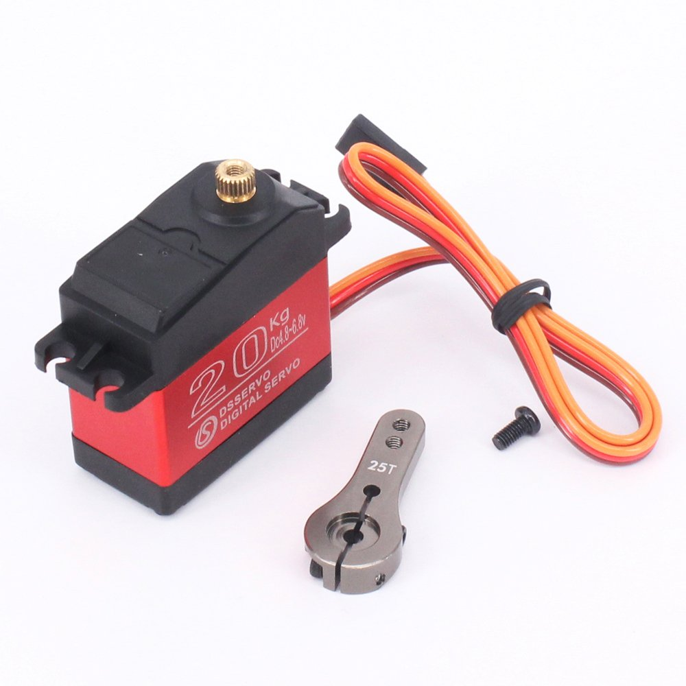

## controller_steering

<p align="center">
  
</p>

### About

The node is a controller for the RC car seering servo (front wheels turn angle).

Node is responsibe to process the input from the joystick and transform the Ackernmann message into the PWM values (integers). For the node we need to devine 2 constant values: PWM value that corresponds max left turn and PWM value for right turn. Based on the defined values, the node will always transform the received values to PWM and send it to the PCA9685 board.

### Feature

A servomotor is a rotary actuator or linear actuator that allows for precise control of angular or linear position, velocity and acceleration. It consists of a suitable motor coupled to a sensor for position feedback. It also requires a relatively sophisticated controller, often a dedicated module designed specifically for use with servomotors.

Servomotors are not a specific class of motor although the term servomotor is often used to refer to a motor suitable for use in a closed-loop control system.

Servomotors are used in applications such as robotics, CNC machinery or automated manufacturing.

Servos (also RC servos) are small, cheap, mass-produced servomotors or other actuators used for radio control and small-scale robotics.

Most servos are rotary actuators although other types are available. Linear actuators are sometimes used, although it is more common to use a rotary actuator with a bellcrank and pushrod. Some types, originally used as sail winches for model yachting, can rotate continuously.

Servo control is achieved by sending a servo a PWM (pulse-width modulation) signal, a series of repeating pulses of variable width where either the width of the pulse (most common modern hobby servos) or the duty cycle of a pulse train (less common today) determines the position to be achieved by the servo. The PWM signal might come from a radio control receiver to the servo or from common microcontrollers such as the Arduino.

Small hobby servos (often called radio control, or RC servos) are connected through a standard three-wire connection: two wires for a DC power supply and one for control, carrying the control pulses.

For more information:
- https://en.wikipedia.org/wiki/Servomotor
- https://en.wikipedia.org/wiki/Servo_(radio_control)
- https://en.wikipedia.org/wiki/Servo_control

### How to start the node

In order to start the node, use the following commands
```
git clone git@github.com:project-omicron/steering.git
cd ./steering/
roslaunch launch/config.launch
roslaunch launch/run.launch
```

### Limitations

Node depends on the libary ```Adafruit_PCA9685``` that is available for Raspberry Pi, for example, but it will not run on x86 systems.
